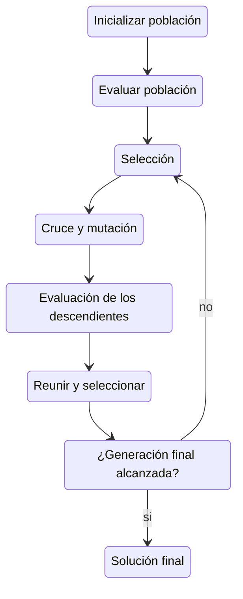

# moea
Algoritmo evolutivo para optimización multiobjetivo aplicado sobre los
conjuntos de prueba ZDT, DTLZ y WFG

## Descripción

Este   repositorio   contiene   una   implementación   del   algoritmo
NSGAII[<sup>1</sup>](#fn1) con pruebas sobre los problemas ZDT, DTLZ y
WFG[<sup>2</sup>](#fn2).   Asimismo se  incluye la  implementación del
algoritmo  de  Kung  para  calcular   el  conjunto  de  soluciones  no
dominadas, también conocido como _frente de pareto_.

El algoritmo  **NSGAII** (Non-dominated Sorting Genetic  Algorithm II)
es  un algoritmo  evolutivo  de optimización  multiobjetivo que  busca
aproximar  el  frente  de  pareto  usando  una  estrategia  basada  en
ordenamiento por dominancia, que tan aislada se encuentra una solución
en el frente  de pareto y lo  que se conoce como  elitismo que permite
garantizar que las mejores soluciones  encontradas hasta el momento no
se pierdan en las siguientes generaciones del algoritmo.

El algoritmo de **Kung** usa una  estrategia de divide y vencerás para
encontrar  el  frente  de  pareto  exacto dentro  de  un  conjunto  de
soluciones ya evaludas.

## Concepto de Dominancia

En  la optimización  multiobjetivo,  una solución  **A  domina a  otra
solución B** si y solo si:

- A no es peor que B en **ningún** objetivo, y
-  A es  **estrictamente mejor**  que  B en  **al menos  uno** de  los
  objetivos.

Formalmente,  si $f_{i}$  denota el  valor del  i-ésimo objetivo  a
minimizar:

$A \prec B \iff \forall i,\  f_i(A) \leq f_i(B) \ \text{y} \ \exists
j,\ f_j(A) < f_j(B)$

Este  criterio  permite  construir  el  conjunto  de  soluciones  **no
dominadas**, también conocido como **frente de Pareto**, donde ninguna
solución es superada simultáneamente en todos los objetivos por otra.

## Implementación de NSGAII



Desglose del diagrama:
- Para inicializar la población se generan soluciones aleatorias
- Para evaluar la población se calcula el valor objetivo de cada solución
- En la selección se eligen los mejores individuos (usando rank y crowding)
- En el cruce y mutación se aplican operadores genéticos para crear nuevos individuos
- En la evaluación de descendientes se evaluan los descendientes generados
- Para reunir y seleccionar se combinan padres e hijos y se eligen los mejores
- La condición de parada es verificar si se alcanzó el número máximo de generaciones
- Al final si ya se alcanzó el número máximo de generaciones se devuelve el frente de pareto

## Implementación del algoritmo de Kung

El algoritmo de Kung utiliza una  estrategia de divide y vencerás para
obtener el frente de pareto de un conjunto de puntos:

- Divide recursivamente el conjunto en mitades
- Calcula el frente de pareto en cada mitad
- Fusiona   ambos  frentes  descartando  las   soluciones  dominadas,
  preservando únicamente las no dominadas

En la implementación  hay dos funciones kung  (kung\_max y kung\_min),
una para  maximizar y otra para  minimizar, por defecto en  el main se
ocupa   la  que   maximiza.  Las   funciones  domina   (domina\_max  y
domina\_min) se usan para evaluar la dominancia entre soluciones.

## Conclusiones

NSGAII  logra aproximar  de manera  eficiente el  frente de  pareto en
problemas de optimización multiobjetivo. Por otro lado el algoritmo de
Kung  permite  encontrar el  frente  de  pareto  exacto dentro  de  un
conjunto de soluciones ya evaluadas.

## Uso

Ejecución del programa
```
python3 src/main.py
```

## Referencias

<a name="fn1">1</a>:  Deb, K.  et al.  NSGA-II.  IEEE  Transactions on
Evolutionary             Computation,             2002.             <a
href="https://ieeexplore.ieee.org/document/996017">A fast  and elitist
multiobjective genetic algorithm: NSGA-II</a>

<a  name="fn2">2</a>:  Todas  las  instancias fueron  tomadas  del  <a
href="https://pymoo.org/problems/index.html">conjunto  de  pruebas  de
pymoo</a>.

<sup>
Todo el código se encuentra bajo la <a href="LICENSE">licencia GPL-3.0</a>.
</sup>
